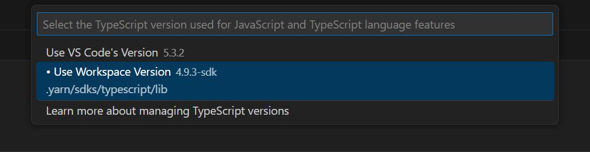

# Potřebné nástroje
- git (https://git-scm.com)
- docker (https://www.docker.com/get-started/)
- editor/ide (preferovaně vscode, https://code.visualstudio.com)

pro lokální vývoj (ne v dockeru) navíc:
- nodejs v18+ (https://nodejs.org)
- yarn (https://yarnpkg.com)
	- je součástí nodejs, takže není třeba ručně instalovat
- php 8.2 (https://www.php.net)
	- Sql Server Driver
		- windows: [link](https://learn.microsoft.com/en-us/sql/connect/php/download-drivers-php-sql-server?view=sql-server-ver16#download) (php_sqlsrv_82_nts_x64.dll)
		- linux: https://pecl.php.net/package/sqlsrv

> Databázová část projektu (packages/database) běží v dockeru vždy

# Instalace a spuštění

## V dockeru
```powershell
git clone "https://github.com/reporting-cz/reporting-boilerplate.git"
cd "reporting-boilerplate"
docker compose up
```

Po tom co docker spustí všechno potřebné by měla být aplikace dostupná na http://localhost:3000.


## Mimo docker
```powershell
corepack enable # https://yarnpkg.com/getting-started/install
git clone "https://github.com/reporting-cz/reporting-boilerplate.git"
cd "reporting-boilerplate"
yarn install
yarn dev
# nebo zvlášť databázi a aplikaci
# docker compose up bp-database
# yarn dev:app
```


# Nastaveí IDE

Kvůli technologii Yarn PnP (https://yarnpkg.com/features/pnp), která ja tady použitá je potřeba určité specifické nastavení editoru, aby během psaní typescript kódu správně fungovala typová kontrola, intellisense apod.

## vscode
### Typescript
- přidat rozšíření *arcanis.vscode-zipfs* (https://marketplace.visualstudio.com/items?itemName=arcanis.vscode-zipfs)
- otevřít libovolný .ts soubor v projektu
	- F1 -> "Select TypeScript Version" -> "Use Workspace Version"





- více tady https://yarnpkg.com/getting-started/editor-sdks#vscode


### PHP
- pro vývoj v PHP ve vscode se hodí https://marketplace.visualstudio.com/items?itemName=xdebug.php-pack
